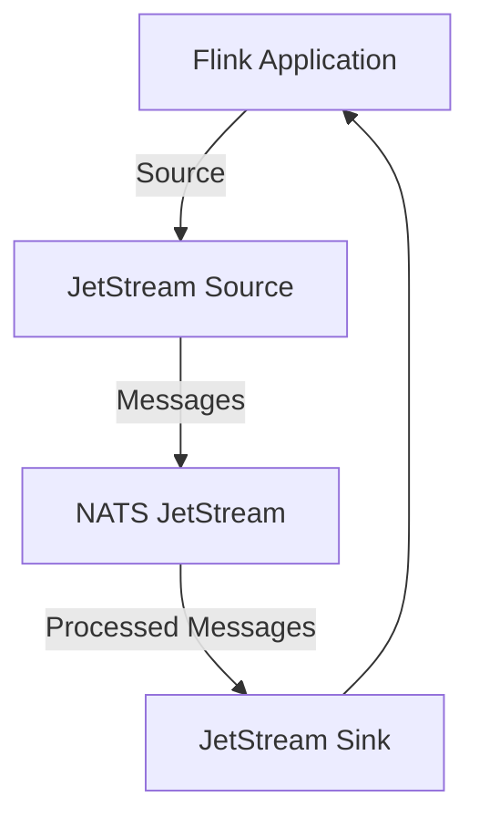
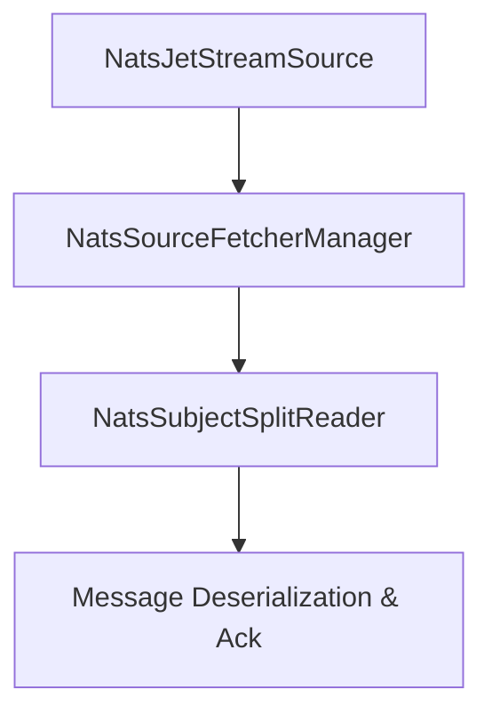
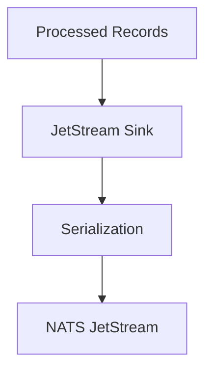
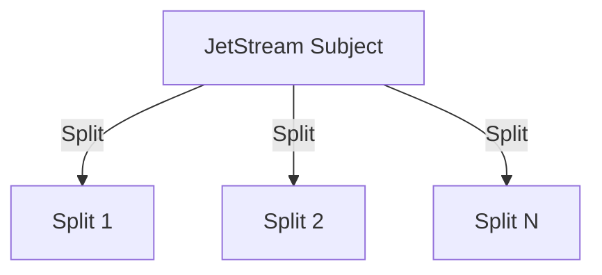
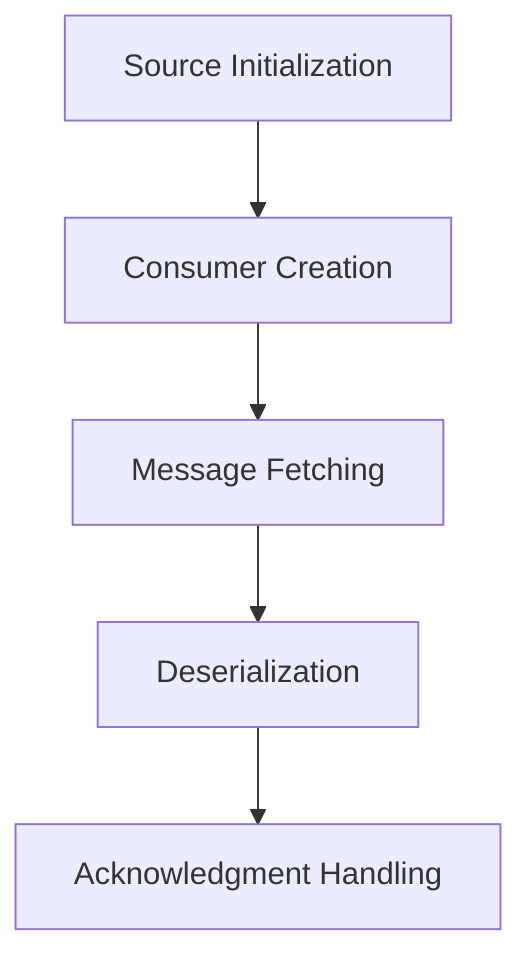

# NATS JetStream Flink Connector Documentation

## Table of Contents
1. [Overview](#overview)
2. [Architecture](#architecture)
    - [High-Level Architecture](#high-level-architecture)
    - [Source Architecture](#source-architecture)
    - [Sink Architecture](#sink-architecture)
3. [Design Principles](#design-principles)
    - [Split-based Parallelism](#split-based-parallelism)
    - [Configuration Builder Pattern](#configuration-builder-pattern)
    - [State Management](#state-management)
4. [Implementation Details](#implementation-details)
    - [Source Implementation](#source-implementation)
    - [Message Flow](#message-flow)
    - [Error Handling and Recovery](#error-handling-and-recovery)
5. [Configuration Guide](#configuration-guide)
6. [Testing Strategy](#testing-strategy)
7. [Performance Considerations](#performance-considerations)
8. [Best Practices](#best-practices)
9. [Monitoring and Maintenance](#monitoring-and-maintenance)

---

## Overview

The **NATS JetStream Flink Connector** enables seamless integration between Apache Flink streaming applications and the NATS JetStream messaging system. This connector provides both source and sink capabilities with support for:

- Bounded and unbounded streams
- Exactly-once processing semantics
- Fault tolerance and recovery
- Parallel processing
- Backpressure handling
- Custom serialization/deserialization

### Core Components

- **JetStream Source**: Reads messages from NATS JetStream subjects with support for bounded/unbounded streams.
- **JetStream Sink**: Publishes processed data back to JetStream subjects.

---

## Architecture

### High-Level Architecture
The connector integrates Flink and NATS JetStream, leveraging Flink's `Source` and `Sink` interfaces for parallel processing and state management. Below is the high-level architecture:

### Source Architecture
The source implementation is based on Flink's `Source` interface with split-based parallel processing.

#### Key Components
- **NatsJetStreamSource**: Main source implementation.
- **NatsSubjectSplitReader**: Handles reading from individual subjects.
- **NatsSourceFetcherManager**: Manages parallel fetching.
- **NatsJetStreamSourceConfiguration**: Configuration management.

### Sink Architecture
The sink implementation follows Flink's `Sink` interface for publishing messages to JetStream.

---

## Design Principles

### Split-based Parallelism
The connector uses subject-based splits for parallel processing. Each split corresponds to a NATS JetStream subject partition, enabling efficient data ingestion and processing.

### Configuration Builder Pattern
The connector adopts a builder pattern for creating configurations, ensuring flexibility and readability during setup.

### State Management
The connector uses Flink's checkpointing mechanism to manage state and ensure exactly-once processing semantics.

---

## Implementation Details

### Source Implementation
The source implementation includes:

1. **Split Reader**: Handles the actual reading of messages from JetStream.
2. **Source Reader**: Manages splits and fetches data from readers.
3. **Configuration Management**: Allows flexible and dynamic configuration.

### Message Flow

### Error Handling and Recovery
The connector implements robust error handling mechanisms:

- **Connection Failures**: Automatic reconnection with exponential backoff.
- **Message Processing Errors**: Retries with configurable limits.
- **Checkpoint Failures**: Ensures consistency during recovery.
- **Split Reader Failures**: Restarts readers with state restoration.

---

## Configuration Guide

### Source Configuration
The source can be configured using either properties or the builder pattern.

#### Key Configuration Parameters:
- **Consumer Name**: Unique identifier for the consumer.
- **Subject Patterns**: Patterns to subscribe to JetStream subjects.
- **Batch Size**: Number of messages to fetch per batch.
- **Fetch Timeout**: Maximum wait time for fetching messages.
- **Acknowledgment Policy**: Determines when messages are acknowledged.
- **Connection Properties**: JetStream connection details.

### Sink Configuration
Similar parameters apply for the sink, focusing on:
- Serialization options.
- Subject destinations.
- Connection lifecycle management.

---

## Testing Strategy

### Test Coverage
- **Unit Tests**: Validate individual components like source, sink, and configuration.
- **Integration Tests**: Ensure end-to-end flows between Flink and NATS JetStream.
- **Performance Tests**: Measure throughput and latency under load.

### Test Implementation
The connector uses JUnit and TestContainers for isolated and reproducible tests.

---

## Performance Considerations

### Batch Size Optimization
- Optimize fetch size to balance throughput and memory usage.

### Connection Management
- Utilize connection pooling and batching to minimize overhead.

### Memory Management
- Bounded queues and backpressure mechanisms prevent memory leaks and ensure smooth processing.

---

## Best Practices

1. **Configuration**:
    - Use appropriate batch sizes and timeouts.
    - Configure consumer groups for scalability.

2. **Error Handling**:
    - Implement retries and exponential backoff strategies.

3. **Performance**:
    - Leverage parallel processing.
    - Monitor backpressure and adjust resource allocation.

---

## Monitoring and Maintenance

### Metrics
- **Message Throughput**: Number of messages processed per second.
- **Processing Latency**: Time taken to process each message.
- **Error Rates**: Frequency of errors during processing.
- **Checkpoint Duration**: Time taken for checkpointing.

### Logging
- Detailed logs for debugging connection issues, acknowledgment failures, and performance bottlenecks.

---

This documentation provides a detailed overview of the **NATS JetStream Flink Connector**, its architecture, design principles, implementation details, and best practices. It is designed to help developers understand and work effectively with the system while maintaining high performance and fault tolerance.
